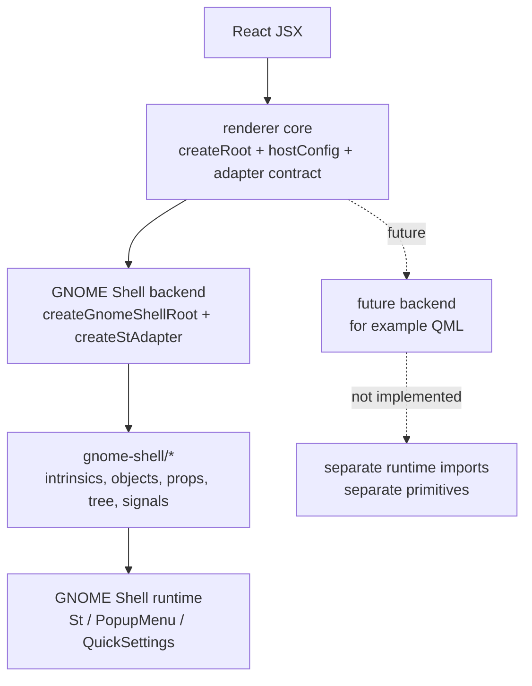

# react-linux architecture

`react-linux` is a React renderer package for Linux-native UI runtimes. The
implemented backend today is GNOME Shell: React components reconcile into Shell
`St`, `PopupMenu`, and `QuickSettings` objects.

The package name is intentionally broader than the current backend. Future
backends, such as QML, should fit beside the GNOME Shell backend through their
own adapter, primitives, runtime imports, tests, and samples. QML is not
implemented now.

This package does not implement an application tray. It provides renderer
infrastructure and backend primitives that an app or Shell extension can use.

## Layers



The core renderer is runtime-agnostic. It knows how React talks to an adapter,
but it does not know how to create GNOME Shell actors or any future QML objects.

The GNOME Shell backend is runtime-specific. It receives actual Shell modules
from the extension and maps React host types to Shell objects.

## Source Layout

| Area | Path | Role |
| --- | --- | --- |
| Core adapter contract | `adapter.ts` | Generic node/text/container operations and common React prop shape. |
| Core root wrapper | `createRoot.ts` | Creates and updates a React reconciler root for any adapter. |
| Core host config | `hostConfig.ts` | React reconciler host config that delegates all platform work to the adapter. |
| GNOME Shell entry point | `gnomeShell.ts` | Creates a root from a Shell container and GNOME Shell toolkit. |
| GNOME Shell adapter | `stAdapter.ts` | Implements the generic adapter contract for Shell `St`/menu/quick settings objects. |
| GNOME Shell backend internals | `gnome-shell/` | Object construction, prop mapping, child attachment, and signal lifecycle. |
| GNOME Shell transports | `gnome-shell/unixSocketHttp.ts` | Optional Gio-backed HTTP over Unix sockets, including an Axios-compatible adapter. |
| GNOME Shell primitives | `primitives.ts` | Current typed React components for Shell `St`, `PopupMenu`, and `QuickSettings`. |
| Mock backend | `mockAdapter.ts` | Test-only adapter for renderer behavior without GNOME Shell. |

If a QML backend is added later, it should get its own backend directory and
entry point rather than adding QML branches inside `gnome-shell/`.

## Core Renderer

`createRoot(container, adapter)` is the backend-agnostic entry point. It only
depends on the `ReactLinuxAdapter` contract:

```ts
interface ReactLinuxAdapter<Node, Text, Container> {
  createInstance(type: string, props: ReactLinuxProps): Node;
  createText(text: string): Text;
  appendChild(parent: Node | Container, child: Node | Text): void;
  insertBefore(parent: Node | Container, child: Node | Text, before: Node | Text): void;
  removeChild(parent: Node | Container, child: Node | Text): void;
  clearContainer(container: Container): void;
  commitUpdate(node: Node, type: string, prevProps: ReactLinuxProps, nextProps: ReactLinuxProps): void;
  resetTextContent(node: Node): void;
  setText(textNode: Text, text: string): void;
  setVisible(node: Node | Text, visible: boolean): void;
  getPublicInstance(node: Node): unknown;
}
```

The root API is deliberately small:

```ts
interface ReactLinuxRoot {
  render(element: ReactNode): void;
  unmount(): void;
}
```

Rendering is synchronous today: `render()` calls `updateContainerSync()` and then
flushes sync work. That matches the current Shell extension use case and avoids
background scheduling assumptions inside GNOME Shell.

## GNOME Shell Backend

`createGnomeShellRoot(container, toolkit, options)` is the current backend entry
point. The Shell extension supplies real GNOME imports:

```tsx
import Clutter from "gi://Clutter";
import St from "gi://St";
import * as PopupMenu from "resource:///org/gnome/shell/ui/popupMenu.js";
import * as QuickSettings from "resource:///org/gnome/shell/ui/quickSettings.js";

const root = createGnomeShellRoot(
  hostActor,
  { Clutter, PopupMenu, QuickSettings, St },
  { eventStopValue: Clutter.EVENT_STOP },
);
```

The package receives those modules as a toolkit object. It must not import Shell
globals at package load time; that keeps the core testable and keeps runtime
ownership with the extension.

Shell-side transport helpers follow the same rule. For example,
`gnome-shell/unixSocketHttp.ts` receives `{ Gio, GLib }` from the extension and
uses `Gio.SocketClient` for Unix socket HTTP. It does not use Node's `http`,
`net`, or Axios Node adapter runtime. See
[Unix Socket HTTP](unix-socket-http.md).

## Component Model

The current primitives compile to GNOME Shell host types:

| React component family | Host type shape | Native object family |
| --- | --- | --- |
| `Box`, `Button`, `Label`, `Icon`, `Entry`, `Widget`, etc. | `st:BoxLayout`, `st:Button`, shorthand names | `St.*` actors |
| `PopupMenuItem`, `PopupSwitchMenuItem`, etc. | `popup:PopupMenuItem`, shorthand names | Shell `PopupMenu.*` objects |
| `QuickToggle`, `QuickSlider`, `QuickMenuToggle`, etc. | `quick:QuickToggle`, shorthand names | Shell `QuickSettings.*` objects |

Escape hatches exist for Shell objects that are not typed yet:

```tsx
<StWidget widget="DrawingArea" reactive />;
<PopupMenuObject object="PopupMenuItem">Open</PopupMenuObject>;
<QuickSettingsObject object="QuickToggle" title="VPN" />;
```

Future backends should avoid reusing these GNOME Shell host type prefixes. A QML
backend, for example, should define its own host type namespace and primitives.

## GNOME Shell Node Model

The GNOME Shell adapter wraps Shell objects in renderer nodes:

```ts
interface GnomeShellElement {
  kind: "element";
  actor: GnomeShellActor;
  object: GnomeShellObject;
  children: GnomeShellNode[];
  parent: GnomeShellElement | GnomeShellContainer | null;
  props: ReactLinuxProps;
  signalIds: number[];
  type: string;
}
```

Most `St` components have the same value for `actor` and `object`. `PopupMenu`
and `QuickSettings` components usually have a Shell object plus an `.actor`.
Keeping both references lets tree code attach the visible actor while prop and
signal code updates the richer Shell object.

Text nodes are represented as `St.Label` actors. Text can also be folded into
native constructor params for text-like host types such as labels, buttons,
popup menu items, and quick settings items.

## GNOME Shell Object Creation

`gnome-shell/objects.ts` owns first construction:

- `St` components call `new toolkit.St[widgetName](initialProps)`.
- `PopupMenu` components call the matching `toolkit.PopupMenu[...]`
  constructor, with special handling for Shell constructors that take text,
  icon, active state, source actor, or submenu flags.
- `QuickSettings` components call the matching `toolkit.QuickSettings[...]`
  constructor with normalized params.

`constructorArgs` is an escape hatch for Shell object constructors that are not
modeled yet. Prefer adding typed mappings once a pattern is stable.

## Props

GNOME Shell props are normalized in two phases:

1. `gnome-shell/props.ts` converts React-ish props into Shell
   constructor/update params.
2. `gnome-shell/applyProps.ts` applies those params to an existing Shell node
   during mount and updates.

Common rules:

- `className` and `styleClass` merge with a generated package class.
- Native Shell classes are preserved where GNOME expects them, such as
  `quick-toggle`, `quick-slider`, and `popup-menu-item`.
- Unknown non-function props pass through to Shell using snake_case conversion.
- Reserved React/renderer props are filtered out before passthrough.
- `hidden` maps to actor visibility.
- `xExpand`, `yExpand`, `style`, and `reactive` map to actor fields.
- Text can come from `text`, `label`, or string/number children depending on the
  component type.

Type-specific rules handle button labels, entry text, icon names, icon sizes,
quick toggle checked state, slider values, popup ornaments, submenu open state,
and progress fill width.

## Tree Attachment

`gnome-shell/tree.ts` translates React child operations into the correct Shell
operation for the parent/child pair.

Normal actor children use the best available actor API:

- `add_child`
- `add_actor`
- `insert_child_at_index`
- `remove_child`
- `set_child` for single-child containers

Popup menu children use Shell menu APIs:

- `addMenuItem`
- `removeMenuItem`
- `moveMenuItem`

Submenu children are attached to the submenu object's `menu`, not to the row
actor itself. Quick menu toggle children follow the same menu-container rule.

Quick settings children are attached by mutating the Shell
`quickSettingsItems` list when the parent exposes it. This is different from
plain actor parenting and is why the backend keeps Shell object and actor
references separately.

Root containers do not have a React node wrapper, so root child order is tracked
in a `WeakMap<GnomeShellContainer, GnomeShellNode[]>`.

## Signals And Events

`gnome-shell/signals.ts` owns GObject signal binding. It disconnects previously
bound signals on every prop application, then reconnects the current handlers.
The node stores signal IDs so unmount can reliably disconnect them.

Supported convenience props:

- `onClick`
- `onActivate`
- `onToggled`
- `signals={{ "notify::checked": handler }}`

Signal targets are Shell objects when an object exists, otherwise actors. The
default event return value is `true`, or `options.eventStopValue` when provided
by the extension.

## Lifecycle

Mount:

1. React calls `hostConfig.createInstance`.
2. The backend adapter creates the native object/actor.
3. Initial props and signals are applied.
4. React appends children through the adapter.
5. Backend tree helpers attach actors/menu items/quick settings items to the
   parent.

Update:

1. React calls `commitUpdate`.
2. Backend `applyProps` updates common, type-specific, and signal props.
3. Child reorders flow through `insertBefore`, using native move APIs where
   available.

Unmount:

1. React removes the node from its parent.
2. Backend destroy logic disconnects signals.
3. Child nodes are destroyed recursively.
4. The native object or actor is destroyed when it exposes `destroy()`.

## Future Backend Rules

Future backends must stay runtime-isolated:

- add a separate backend adapter and backend internals;
- add backend-specific primitives or a backend-scoped entry point;
- do not import QML, GTK, or other runtime modules from the GNOME Shell backend;
- do not make the root package import runtime modules at module load time;
- keep shared behavior in the core adapter/reconciler layer only when it is
  truly runtime-agnostic.

This keeps `react-linux` open to QML later without making the current GNOME
Shell implementation pretend QML already exists.
